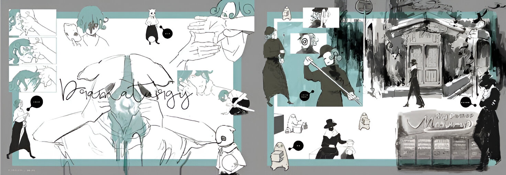

 

<h1 align="center">✨ ¡Hola, soy Oreki Houtarou! ✨</h1>
<h3 align="center">🌌 Desarrollador | Fan del anime y el código 🍜</h3>

---

  

---

## 🌟 Sobre mí

- 🌐 **Nombre real:** Bryan Montenegro.
- 🎓 **Idiomas de programación:** Java, HTML, JavaScript, React, React Native.
- 🚀 **Stack:** Firebase, React Native con Expo, MySQL y SQL Server.
- 📖 **Curiosidad:** Me encanta el diseño inspirado en animes, en especial los toques minimalistas.

---

## 🛠️ Tecnologías que manejo

  
  
  
  
  
  
  
  
  

---

## 📂 Proyectos Destacados

- 🐄 **Trazabilidad Ganadera**: Proyecto que lleve a Hackaton Nicaragua por primera vez.
- 🩸 **Proyecto Redvita**: Sistema para la gestión de donantes y visualización de estadísticas relacionadas la donaciones. [Ir al repo](https://github.com/BrayanMontenegro/ProyectRedvita.git)
- 📊 **Protectos personales**: Gestión de cosas que uso en general para aprender.

---

## 🎨 Inspiración y estilo

- 💡 **Diseño Minimalista:** Influenciado por animes como Hyouka, Studio Ghibli, Jujutsu Kaisen, entre otros.
- 🎮 **Hobbies:** Desarrollo de proyectos personales y diseño de interfaces inspiradas en el anime.

---

  

---

## 🌐 Conecta conmigo

  

---

  <h3>✨ ¡Gracias por visitar mi perfil! ✨</h3>
  

